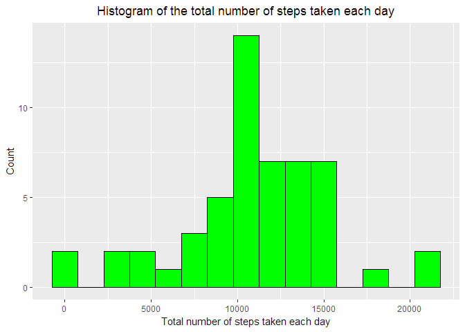
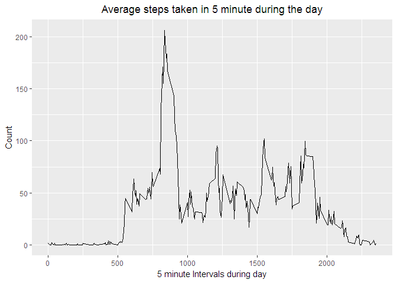
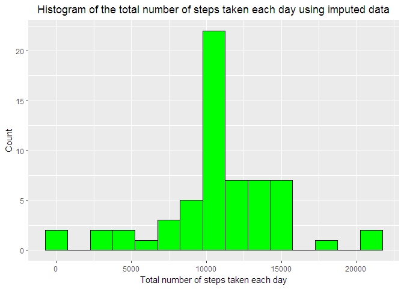
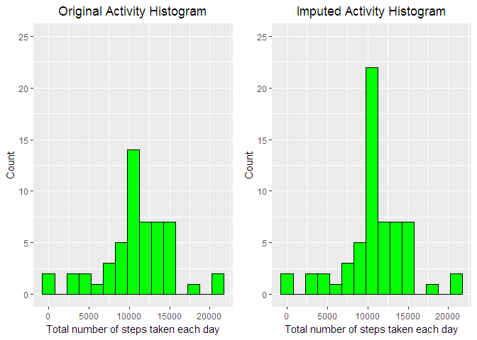
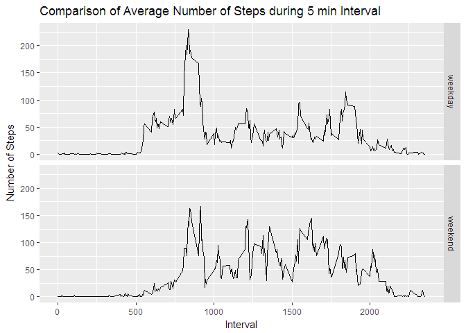

# ***Research on Fitness Activity***
---

## Loading and preprocessing the data
1. Load Activity data from activity.zip

```r
# Load libraries needed for research
require(dplyr)
require(data.table)
require(ggplot2)
require(knitr)
require(gridExtra)
```

```r
# NOTE: Assuming activity.zip is in current working directory
data <- read.table(unz("activity.zip", "activity.csv"), header=TRUE, quote="\"", sep=",")
```

2. Examine Activity data  

```r
summary(data)
```

```
##      steps                date          interval     
##  Min.   :  0.00   2012-10-01:  288   Min.   :   0.0  
##  1st Qu.:  0.00   2012-10-02:  288   1st Qu.: 588.8  
##  Median :  0.00   2012-10-03:  288   Median :1177.5  
##  Mean   : 37.38   2012-10-04:  288   Mean   :1177.5  
##  3rd Qu.: 12.00   2012-10-05:  288   3rd Qu.:1766.2  
##  Max.   :806.00   2012-10-06:  288   Max.   :2355.0  
##  NA's   :2304     (Other)   :15840
```

```r
head(data)
```

```
##   steps       date interval
## 1    NA 2012-10-01        0
## 2    NA 2012-10-01        5
## 3    NA 2012-10-01       10
## 4    NA 2012-10-01       15
## 5    NA 2012-10-01       20
## 6    NA 2012-10-01       25
```

## What is mean total number of steps taken per day?
1. Calculate total number of steps taken per day 
   **Note:** Ignore missing values.

```r
# Aggregate steps by date, ignore missing values  
steps.per.day <- na.omit(aggregate(data$steps, by = list(date = data$date), FUN = sum))
names(steps.per.day) <- c("date", "steps")
head(steps.per.day)
```

```
##         date steps
## 2 2012-10-02   126
## 3 2012-10-03 11352
## 4 2012-10-04 12116
## 5 2012-10-05 13294
## 6 2012-10-06 15420
## 7 2012-10-07 11015
```

2. Plot Histogram of the total number of steps taken each day

```r
# Set appropriate binwidth to plot the histogram
act.binwidth <- 1500
# Store the plot in variable. This will help to compare this plot with another one
hist.plot <- ggplot(data = steps.per.day, aes(x = steps)) +
        geom_histogram(fill = "green", color = "black", binwidth = act.binwidth) +
        labs(   x="Total number of steps taken each day",
                y="Count",
                title="Histogram of the total number of steps taken each day") +
        theme(plot.title = element_text(hjust = 0.5), legend.position = "none")
print(hist.plot)
```

<!-- -->

3. Calculate Mean and Median of total number of steps taken each day


```r
mean.steps.per.day <- mean(steps.per.day$steps)
median.steps.per.day <- median(steps.per.day$steps)
```


```r
# Print Mean
mean.steps.per.day
```

```
## [1] 10766.19
```

```r
# Print Median
median.steps.per.day
```

```
## [1] 10765
```

## What is the average daily activity pattern?
1. Calculate average number of steps taken in 5 minute intervals during the day and plot a time series graph showing average number of steps taken in 5 minute intervals during the day

```r
# Aggregate by interval ignoring missing values  
avg.steps.by.interval <- aggregate(data$steps, by = list(interval = data$interval), FUN = mean, na.rm = TRUE)
names(avg.steps.by.interval) <- c("interval", "steps")
head(avg.steps.by.interval)
```

```
##   interval     steps
## 1        0 1.7169811
## 2        5 0.3396226
## 3       10 0.1320755
## 4       15 0.1509434
## 5       20 0.0754717
## 6       25 2.0943396
```

```r
ggplot(data = avg.steps.by.interval, aes(x = interval, y = steps)) +
        geom_line() +
        labs(   x="5 minute Intervals during day",
                y="Count",
                title="Average steps taken in 5 minute during the day") +
        theme(plot.title = element_text(hjust = 0.5), legend.position = "none")
```

<!-- -->

2. Now, let's check 5-minute interval on average across all the days that contains the maximum number of steps

```r
avg.steps.by.interval[avg.steps.by.interval$steps == max(avg.steps.by.interval$steps),]
```

```
##     interval    steps
## 104      835 206.1698
```

## Imputing missing values
Note that there are a number of days/intervals where there are missing values (coded as NA). The presence of missing days may introduce bias into some calculations or summaries of the data.

1. Let's check total number of missing values in the dataset (i.e. the total number of rows with NAs)  

```r
sapply(X = data, FUN = function(x) sum(is.na(x)))
```

```
##    steps     date interval 
##     2304        0        0
```

2. To fill the missing values, use mean for that 5-minute interval. Use round function to remove any fractions.

3. Create new dataset filling the missing values

```r
new.data <- as.data.frame(
                data %>%
                group_by(interval) %>%
                mutate(steps = ifelse(is.na(steps), round(mean(steps, na.rm = TRUE)), steps)) %>%
                ungroup()
        )
```
Confirm there are no longer NAs.

```r
sapply(X = new.data, FUN = function(x) sum(is.na(x)))
```

```
##    steps     date interval 
##        0        0        0
```
Spot compare few observations from original and new data. Confirm only NAs are replaced.

```r
obs <- c(1, 5, 10, 50, 100, 500, 1000, 5000, 10000)
data[obs,]
```

```
##       steps       date interval
## 1        NA 2012-10-01        0
## 5        NA 2012-10-01       20
## 10       NA 2012-10-01       45
## 50       NA 2012-10-01      405
## 100      NA 2012-10-01      815
## 500       0 2012-10-02     1735
## 1000      0 2012-10-04     1115
## 5000    757 2012-10-18      835
## 10000    NA 2012-11-04     1715
```

```r
new.data[obs,]
```

```
##       steps       date interval
## 1         2 2012-10-01        0
## 5         0 2012-10-01       20
## 10        1 2012-10-01       45
## 50        1 2012-10-01      405
## 100     158 2012-10-01      815
## 500       0 2012-10-02     1735
## 1000      0 2012-10-04     1115
## 5000    757 2012-10-18      835
## 10000    61 2012-11-04     1715
```
Calculate total number of steps taken per day. 

```r
new.steps.per.day <- na.omit(aggregate(new.data$steps, by = list(date = new.data$date), FUN = sum))
names(new.steps.per.day) <- c("date", "steps")
head(new.steps.per.day)
```

```
##         date steps
## 1 2012-10-01 10762
## 2 2012-10-02   126
## 3 2012-10-03 11352
## 4 2012-10-04 12116
## 5 2012-10-05 13294
## 6 2012-10-06 15420
```

4. Plot Histogram of the total number of steps taken each day using new data

```r
# Use binwidth set in earlier histogram
# Store the plot in a variable. This will help to compare this plot with another one
new.hist.plot <- ggplot(data = new.steps.per.day, aes(x = steps)) +
        geom_histogram(fill = "green", color = "black", binwidth = act.binwidth) +
        labs(   x="Total number of steps taken each day",
                y="Count",
                title="Histogram of the total number of steps taken each day using imputed data") +
        theme(plot.title = element_text(hjust = 0.5), legend.position = "none")
print(new.hist.plot)
```

<!-- -->

Calculate Mean and Median of total number of steps taken each day using new data


```r
new.mean.steps.per.day <- mean(new.steps.per.day$steps)
new.median.steps.per.day <- median(new.steps.per.day$steps)
```


```r
compare.stats <- data.frame(mean = c(mean.steps.per.day, new.mean.steps.per.day),
                            median = c(median.steps.per.day, new.median.steps.per.day))
rownames(compare.stats) <- c("Original Data", "Imputed Data")
compare.stats
```

```
##                   mean median
## Original Data 10766.19  10765
## Imputed Data  10765.64  10762
```

**Observation:** Imputing missing data using mean for that 5-minute interval did slightly impact both mean and median.  

Compare the two histograms

```r
# Apply same 'Y-limit' to both histograms and adjust main Titles
hist.plot <- hist.plot + ylim(0, 25) + ggtitle("Original Activity Histogram")
new.hist.plot <- new.hist.plot + ylim(0, 25) + ggtitle("Imputed Activity Histogram")
grid.arrange(hist.plot, new.hist.plot, nrow = 1)
```

<!-- -->

**Observation:** From the above comparison, we see that the interval with highest count of the new version data is larger than that in the original one with NAs.

## Are there differences in activity patterns between weekdays and weekends?

1. Add a factor to imputed data to categorized observation into weekday or weekend.

```r
weekend.days = c("Saturday", "Sunday")
new.data$day.type <- ifelse(weekdays(as.Date(new.data$date)) %in% weekend.days, "weekend", "weekday")
head(new.data)
```

```
##   steps       date interval day.type
## 1     2 2012-10-01        0  weekday
## 2     0 2012-10-01        5  weekday
## 3     0 2012-10-01       10  weekday
## 4     0 2012-10-01       15  weekday
## 5     0 2012-10-01       20  weekday
## 6     2 2012-10-01       25  weekday
```

2. Plot time series of 5-minute interval and average number if steps taken, averaged across all weekday days or weekend days. 

```r
steps.by.day.type <- (new.data %>% group_by(interval, day.type) %>% summarise(avg.steps = mean(steps)))
ggplot(steps.by.day.type, mapping = aes(x = interval, y = avg.steps)) + geom_line() +
        facet_grid(day.type ~.) + 
        xlab("Interval") + 
        ylab("Number of Steps") +
        ggtitle("Comparison of Average Number of Steps during 5 min Interval")
```

<!-- -->

---
